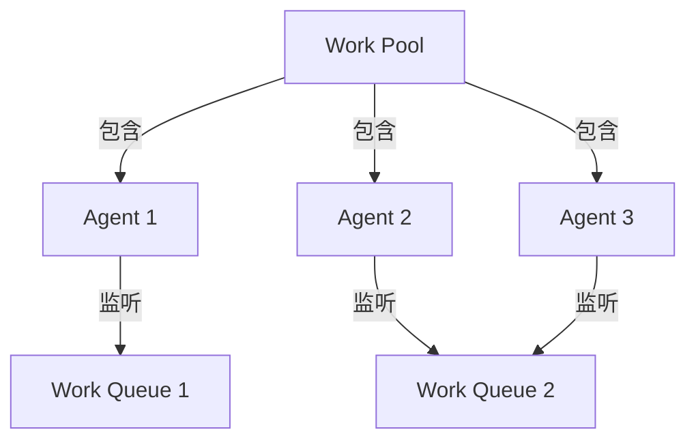

# 说明

## 本地任务批量处理
ComfyUI 批处理服务支持多服务器并行处理图片任务，具有自动负载均衡和错误重试机制。

## 模块设计

系统由以下核心组件构成：

1. 检索器（FileRetriever）
   - 负责扫描指定文件夹，检索待处理的图片素材
   - 支持多文件夹扫描和文件类型过滤
   - 可通过关键词匹配特定文件夹

2. 工作流管理器（WorkflowManager）
   - 负责加载和管理 ComfyUI 工作流配置
   - 处理图片预处理和工作流参数配置
   - 生成适配 ComfyUI API 的任务描述

3. 任务分发器（TaskDispatcher）
   - 管理多个 ComfyUI 服务器节点
   - 实现任务的负载均衡分发
   - 处理任务队列和结果获取
   - 支持任务状态监控和错误处理

4. 批处理服务（BatchProcessor）
   - 协调各组件工作的核心服务
   - 实现批量任务的并行处理
   - 提供任务重试和错误恢复机制
   - 支持灵活的输出配置和结果管理

## Prefect 工作流使用

系统使用 Prefect 进行工作流编排，提供以下特性：
- 任务重试和错误处理
- 工作流状态监控
- 并行任务调度
- 日志管理

### 配置示例

```python
from pathlib import Path
from src.service import BatchProcessor, ServiceConfig

# 创建服务配置
config = ServiceConfig(
    # 目标文件夹配置
    target_folders=[Path("path/to/your/images")],
    folder_keywords=["optional_keyword"],  # 可选的文件夹关键词过滤
    
    # 工作流配置
    workflow_path=Path("modules/comfyui/workflows/your_workflow.json"),
    node_config_path=Path("modules/comfyui/workflows/config.json"),
    
    # 批处理配置
    batch_size=5,  # 每批处理的图片数量
    output_root=Path("outputs")  # 输出目录
)

# 创建并运行处理器
processor = BatchProcessor(config)
await processor.run()
```

### 工作流结构

系统包含以下主要工作流：

1. `main_flow`: 主工作流
   - 管理整体处理流程
   - 协调多文件夹处理

2. `process_folder`: 文件夹处理工作流
   - 处理单个文件夹
   - 管理批次划分

3. `scan_folders`: 文件扫描任务
   - 扫描目标文件夹
   - 应用文件过滤规则

4. `process_batch`: 批处理任务
   - 并行处理图片批次
   - 实现负载均衡
   - 错误重试机制

## 服务部署和运行

### 1. 通过 Prefect v3 部署

1. 创建 `prefect.yaml` 配置文件
```yaml
name: comfyui-batch-service

prefect-version: 2.14.12

entrypoints:
  - name: main
    module: run_service
    flow_name: main_flow

deployments:
  - name: comfyui-batch-process
    entrypoint: main
    work_pool:
      name: default
      work_queue_name: default
    schedule: null
    parameters:
      target_folders:
        - "path/to/your/images"
      workflow_path: "modules/comfyui/workflows/your_workflow.json"
      node_config_path: "modules/comfyui/workflows/config.json"
      batch_size: 5
      folder_keywords: []
    tags:
      - comfyui
      - batch
```

2. 部署流程
```bash
# 创建工作池（如果不存在）
prefect work-pool create default --type process

# 部署
prefect deploy

# 启动 worker
prefect worker start -p default
```

3. 运行部署
```bash
# 通过命令行运行
prefect deployment run comfyui-batch-service/comfyui-batch-process

# 或通过 UI 运行
# 访问 http://localhost:4200 -> Deployments
```

配置说明：
- `name`: 项目名称
- `prefect-version`: Prefect 版本
- `entrypoints`: 入口点配置
  - `module`: Python 模块路径
  - `flow_name`: 流程函数名
- `deployments`: 部署配置
  - `work_pool`: 工作池设置
  - `parameters`: 运行参数
  - `tags`: 标签

### 2. 通过 API 调用

可以通过 Python API 远程触发和管理工作流：

```python
from prefect.client import get_client
from prefect.deployments import run_deployment
from prefect.flows import get_flow_run_info

async def trigger_batch_process(
    target_folders: list[str],
    workflow_path: str,
    node_config_path: str,
    batch_size: int = 5,
    folder_keywords: list[str] = None,
) -> str:
    """触发批处理任务

    Args:
        target_folders: 目标文件夹列表
        workflow_path: 工作流配置文件路径
        node_config_path: 节点配置文件路径
        batch_size: 批处理大小
        folder_keywords: 文件夹关键词列表

    Returns:
        str: 流程运行ID
    """
    async with get_client() as client:
        # 运行部署
        deployment_id = await run_deployment(
            name="comfyui-batch-process",
            parameters={
                "target_folders": target_folders,
                "workflow_path": workflow_path,
                "node_config_path": node_config_path,
                "batch_size": batch_size,
                "folder_keywords": folder_keywords or [],
            },
            client=client,
        )
        return deployment_id

async def get_flow_status(flow_run_id: str) -> dict:
    """获取流程运行状态

    Args:
        flow_run_id: 流程运行ID

    Returns:
        dict: 运行状态信息
    """
    async with get_client() as client:
        flow_run = await client.read_flow_run(flow_run_id)
        return {
            "status": flow_run.state.name,
            "start_time": flow_run.start_time,
            "end_time": flow_run.end_time,
            "total_run_time": flow_run.total_run_time,
        }

# 使用示例
async def main():
    # 触发任务
    flow_run_id = await trigger_batch_process(
        target_folders=["path/to/images"],
        workflow_path="modules/comfyui/workflows/workflow.json",
        node_config_path="modules/comfyui/workflows/config.json",
        batch_size=5,
    )
    print(f"Started flow run: {flow_run_id}")

    # 获取状态
    status = await get_flow_status(flow_run_id)
    print(f"Flow status: {status}")
```

### 3. 监控和通知

1. UI 监控
- Flow runs: 查看所有运行记录
- Task runs: 查看具体任务执行情况
- Logs: 查看详细日志

2. 通知设置
- 支持 Email、Slack 等通知渠道
- 可配置任务失败、完成等事件触发
- 在 UI 的 Notifications 页面配置

### 部署配置详解

1. 工作队列和工作池
```yaml
work_queue_name: default  # 工作队列名称
work_pool_name: default   # 工作池名称
```

工作队列（Work Queue）:
- 用于任务的排队和分发
- 可以设置并发限制和优先级
- 支持按标签路由任务
- 常见用途：
  - 任务分类：不同类型任务使用不同队列
  - 资源隔离：CPU密集型和IO密集型任务分开
  - 优先级管理：紧急任务使用高优先级队列

工作池（Work Pool）:
- 管理执行任务的工作节点集合
- 提供基础设施配置
- 支持不同类型的执行环境：
  - process: 本地进程执行
  - kubernetes: K8s 集群执行
  - docker: Docker 容器执行
- 用途：
  - 资源管理：控制计算资源分配
  - 环境隔离：不同环境使用不同工作池
  - 扩展性：支持横向扩展

2. 标签系统
```yaml
tags:
  - comfyui
  - batch
```

标签的作用：
- 任务分类和筛选
  - 在 UI 中快速过滤任务
  - API 查询时按标签筛选
- 工作流管理
  - 标识任务类型和用途
  - 分组相关任务
- 权限控制
  - 基于标签的访问控制
  - 团队协作时的任务分配
- 监控和统计
  - 按标签统计任务执行情况
  - 生成分类报告

使用建议：
1. 工作队列配置
```bash
# 创建新的工作队列
prefect work-queue create "high-priority" --tags high-priority

# 启动特定队列的 agent
prefect agent start -q "high-priority" --limit 10
```

2. 工作池配置
```bash
# 创建新的工作池
prefect work-pool create "gpu-pool" --type process

# 配置工作池
prefect work-pool update "gpu-pool" --concurrency-limit 2
```

3. 标签使用
```yaml
# 部署配置示例
tags:
  - comfyui        # 系统标识
  - batch          # 处理类型
  - high-priority  # 优先级
  - gpu            # 资源需求
```

### Work Pool 和 Agent 的区别

1. Work Pool（工作池）
- 是一个逻辑概念，代表一组计算资源
- 定义了任务执行的基础设施类型（process/k8s/docker）
- 可以包含多个 worker（工作进程）
- 配置示例：
```bash
# 创建工作池
prefect work-pool create "image-process-pool" \
    --type process \
    --concurrency-limit 5

# 查看工作池状态
prefect work-pool ls
```

2. Agent（代理）
- 是实际运行任务的执行者
- 负责监听特定的工作队列
- 在工作池中运行，执行具体任务
- 配置示例：
```bash
# 启动 agent 并指定工作队列
prefect agent start -q "default" \
    --pool "image-process-pool" \
    --limit 3
```

3. 关系说明


4. 主要区别
| 特性 | Work Pool | Agent |
|------|-----------|--------|
| 职责 | 资源管理和分配 | 任务执行和监控 |
| 范围 | 基础设施级别 | 进程级别 |
| 配置 | 基础设施类型、并发限制 | 队列绑定、执行限制 |
| 生命周期 | 持久存在 | 可动态启停 |
| 扩展性 | 定义扩展策略 | 实现具体扩展 |

5. 使用场景
- 单机部署：
  ```bash
  # 创建本地工作池
  prefect work-pool create "local-pool" --type process
  
  # 启动单个 agent
  prefect agent start -q "default" --pool "local-pool"
  ```

- 分布式部署：
  ```bash
  # 创建分布式工作池
  prefect work-pool create "distributed-pool" --type kubernetes
  
  # 在不同节点启动多个 agent
  prefect agent start -q "queue1" --pool "distributed-pool"
  prefect agent start -q "queue2" --pool "distributed-pool"
  ```

6. 最佳实践
- Work Pool 配置
  - 根据资源类型选择合适的工作池类型
  - 设置合理的并发限制
  - 配置资源标签和约束

- Agent 配置
  - 合理分配队列监听
  - 设置任务执行限制
  - 配置重试策略